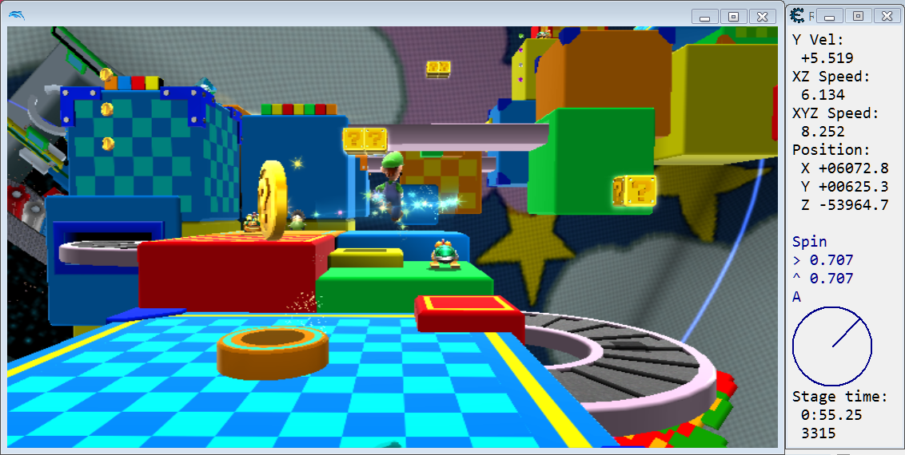

# ram-watch-cheat-engine

Sample videos:

- [Super Mario Galaxy - Tilt research](https://www.youtube.com/watch?v=Hri8f8Pgim8)
- [Sonic Adventure 2: Battle - Inputs and coordinates, by Tales](https://www.youtube.com/watch?v=Cp1txiez0OM)
- [F-Zero GX - Replay inputs and status, customized by superSANIC](https://www.youtube.com/watch?v=ntQt6srYo6A)

## Overview

RAM watch is a powerful tool for researching games - for modding, speedrunning, writing cheat codes, or just generally learning how the game works.

The [tool-assisted speedrun community](http://tasvideos.org/) makes extensive use of RAM watch on emulated games. The most popular Gamecube/Wii emulator is Dolphin, and so far, Cheat Engine has been the most popular RAM watch solution for Dolphin. Here's a nice [tutorial by aldelaro](http://tasvideos.org/forum/viewtopic.php?t=17735) on using Cheat Engine with Dolphin.

In addition to supporting RAM viewing, searching, and editing, Cheat Engine also includes a Lua scripting engine. This opens up many more possibilities for boosting research productivity, including:

- More interactivity. With Lua scripting, you can create a separate Cheat Engine window with arbitrary GUI elements: buttons, text fields, and so on. You can record values to a .txt file as the game runs, and then paste results into a spreadsheet to make a graph (e.g. showing your character's speed over time).

- More flexible RAM viewing compared to Cheat Engine's address list display. For example, you can set your font and font size, limit the number of decimal places in a float, and make the display update as often as once per frame.

- It's easier to build upon previous results. Instead of entering the same pointer base for 10 different address list entries, you can save that pointer to a Lua variable and re-use that variable. You can run RAM values through formulas like sqrt(x^2 + y^2) and display the result.

This repository contains:

- Ready-to-use RAM display layouts for several games.

- A Lua code framework for writing custom RAM displays with the features described above. The main focus of the framework is on games running in Dolphin emulator, but the framework can also be used for PC games and other emulators.

- A tutorial to help you get started.

## Requirements

Windows, Mac, or Linux. Cheat Engine and Dolphin are supported on all of these platforms, though Windows is probably easiest for Cheat Engine. Also, the tutorial here assumes Windows, but the explanations shouldn't change that much between platforms.

No programming or Lua experience is required for the first few tutorial sections. For the later sections on writing your own displays and game scripts, some programming experience will make it easier, but the tutorial attempts to walk through things slowly for beginners.

## Getting started

Go through the [Tutorial](/docs/tutorial/index.md) until you've got enough knowledge to do your game research.

Here's the first tutorial section: [Get a RAM watch script up and running](/docs/tutorial/run.md).

As a general recommendation, it's okay to skip doing a tutorial section if it doesn't really apply to you, but reading the sections you skip is probably still a good idea.

## Support

If you're having problems before even touching the Lua code, you might want to read [aldelaro's tutorial](http://tasvideos.org/forum/viewtopic.php?t=17735) on using Cheat Engine with Dolphin.

If you're getting Lua errors or the Lua script isn't doing what you expect, try the [troubleshooting and debugging page](/docs/debugging.md).

If you've got a question, problem, error message, etc. that you want to ask about, try [this TASvideos forum thread](http://tasvideos.org/forum/viewtopic.php?t=18685). Note: In the Lua Engine window, the latest Lua error appears BELOW previous errors.

If you've got more of a suggestion or request, or you think you've found a bug, it might fit better in the GitHub issues section. In general, though, feel free to post at either GitHub or TASvideos.

I encourage asking questions publicly with the methods above so others can learn too, but messaging me ([yoshifan](https://github.com/yoshifan)) directly is fine too. Feel free to contact me on Twitter or Discord, send a TASvideos PM, or whatever is convenient.

## Disclaimer

Cheat Engine is a powerful tool, so don't be too careless when using it. For example, if you ever attempt to edit memory (such as when using the F-Zero GX stat-editing layouts), make extra sure that you've selected the Dolphin.exe process in Cheat Engine, and not some other process on your computer.

The primary authors of this GitHub repository are not affiliated with Dolphin, Cheat Engine, or the companies behind the games mentioned here.

## Credits

Masterjun, for writing the Dolphin + Cheat Engine RAM watch script that this project was based on: http://tasvideos.org/forum/viewtopic.php?t=14379 (2013.08.26)

Tales, for providing the Sonic Adventure DX and Sonic Adventure 2: Battle scripts that were added to this repository (with slight modifications).

aldelaro, for the Dolphin + Cheat Engine tutorial I've linked a few times in these docs.
