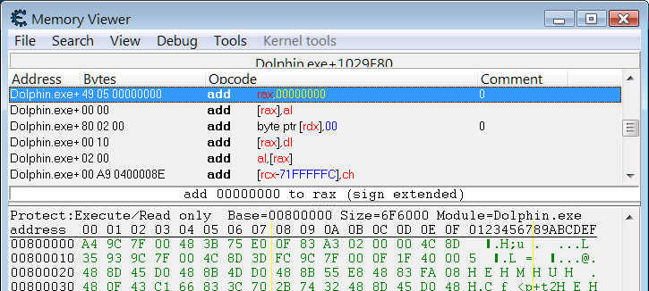

# Run with a different Dolphin version

The first tutorial section specifically said to use Dolphin 5.0. The reason is that there are a couple of required addresses which are specific to the Dolphin version.

It's not that much effort to find these addresses for a different Dolphin version. It's just a bit of additional complexity that we decided to sidestep in the initial tutorials. We'll cover these addresses now.


## Finding the `frameCounterAddress`

Start your preferred version of Dolphin, and start your Gamecube/Wii game. Get to a point where the game isn't in the middle of loading anything, then pause emulation. Open the Dolphin process in Cheat Engine.

Now in the Cheat Engine main window, select Value Type of "4 Bytes", and a Scan Type of "Unknown initial value". Do a First Scan. Once it's finished, you shouldn't see anything in the scan results list yet; that's normal.

Now go to Dolphin and advance your game by 5 frames. Go back to Cheat Engine, change the Scan Type to "Increased value by ...", type 5 in the Value box, and click Next Scan. Repeat this process a couple more times, possibly using different numbers of frames as well. Eventually the results should be narrowed down a fair bit.

Now pick an address from the results list. Try to pick a green address, as that is a static address which should not change as long as you're using the same Dolphin version.


- In Dolphin 5.0 or later, and possibly some 4.x versions, there are typically two green addresses that start with 0. The first address counts the number of frames the game has been running during that Dolphin session. The second address counts frames in the game's state, so loading a savestate will make this jump to a different value. Either address should work fine.

Right-click one of the addresses and choose "Disassemble this memory region". A Memory Viewer dialog will pop up.

Look near the top of the Memory Viewer dialog, just below the menu bar. You should see the text `Dolphin.exe+` followed by a hexadecimal number. (A hexadecimal number is a sequence of digits 0-9 and letters A-F).


The hex number is our `frameCounterAddress`. In this example we have `Dolphin.exe+1029F80`, so our `frameCounterAddress` is `1029F80`. (If you see a filename other than `Dolphin.exe`, try picking a different address from the scan results.)

- In older versions of Cheat Engine, certain Windows DPI/font settings may cut off the bottom of the hex number's text, making certain digits ambiguous (such as E versus F):

  
   
  Two ways to deal with this:

  - Download Cheat Engine 6.6 or later, and use that.

  - Look back at the full address in the scan results. Hopefully, the last 5 digits of this full address should match the last 5 digits of the `frameCounterAddress`. You may still have to guess the first 1 or 2 digits, though.


## Finding the `oncePerFrameAddress`

Go back to the main Cheat Engine window. Double-click the frame-counter address to add it to the bottom box. Right-click the address in the bottom box, and choose "Find out what writes to this address". Choose Yes if you get a Confirmation dialog. Then another dialog will pop up.

Now advance your Dolphin game by 5 frames again. Hopefully an entry will appear in the dialog that just popped up, with the number 5 in the Count column (if not, try a different address). Click the Stop button.


Right-click that entry and choose "Show this address in the disassembler". Again, look at the top of the dialog to find `Dolphin.exe+` followed by a hex number. Use that hex number as the `oncePerFrameAddress`.


## Specifying the addresses in your Cheat Table script

Locate this part of the Cheat Table script:

```lua
  -- Addresses for Dolphin 5.0
  frameCounterAddress = 0x00E8CF60,
  oncePerFrameAddress = 0x004F4495,
```

Change these lines to the addresses you've found for your Dolphin version.

- Be sure to keep the `0x` part, as that informs Lua that it's a hexadecimal number. The other leading zeros are optional. So if the previous step gave you `Dolphin.exe+E8CF90`, then you can put either `0xE8CF90` or `0x00E8CF90` here.

The comment (line starting with `--`) doesn't change the functionality of the code; it's just there for your information. You may as well update this comment to specify the Dolphin version you're using, like this:
 
```lua
  -- Dolphin 5.0-3967
  frameCounterAddress = 0x01100888,
  oncePerFrameAddress = 0x0057D11C,
```
 
Or, if you go back and forth between multiple Dolphin versions, you can leave commented-out code lines for other versions for your later convenience.
 
```lua
  -- 5.0
  --frameCounterAddress = 0x00E8CF60,
  --oncePerFrameAddress = 0x004F4495,
  -- 5.0-2692
  --frameCounterAddress = 0x01072CF0,
  --oncePerFrameAddress = 0x00537632,
  -- 5.0-3967
  frameCounterAddress = 0x01100888,
  oncePerFrameAddress = 0x0057D11C,
```


## Testing

Pick any RAM display layout which contains the function name `setBreakpointUpdateMethod`. (These are the layouts that use both `frameCounterAddress` and `oncePerFrameAddress`). Use that layout's name in your Cheat Table script.

Click Execute Script. Check that the display works, and is updating as expected.


## (Optional) `constantGameStartAddress`

Each time you click Execute Script for a Dolphin game, one of the first script actions is to figure out the address where the Gamecube/Wii game's memory starts. This is done automatically by running a Cheat Engine scan for the game ID (for Metroid Prime in North America, `GM8E01`) as a string, and then selecting one of the addresses that ends in 0000.

This scan can be slow, and annoying to wait for whenever you need to keep fixing and re-running your script. And in many cases, the game start address will stay the same between script runs, rendering the scan unnecessary:

  - If you haven't restarted your Dolphin game since your last script run, the game start address should still be the same.
  
  - If you have restarted your Dolphin game or the Dolphin emulator, the game start address is quite likely to stay the same. Notable exceptions include the earlier Dolphin 3.x versions.
  
  - If you have switched to a different Dolphin version, the game start address might still stay the same, especially if the version dates aren't too different. (If you're curious about some examples, see [this TASvideos post](http://tasvideos.org/forum/viewtopic.php?p=431008#431008).)
  
So in many cases, it makes sense to specify a `constantGameStartAddress`. If you do this, the script will skip the game-start-address scan, and you'll save several seconds each time you click Execute Script.

First, you'll want to find your game's 6-character game ID. In Dolphin, right-click your game on the game list. Select Properties. The game ID should be on the title bar of the Properties window.

Then do the Cheat Engine scan. Here's what it looks like:


You'll probably want one of the addresses ending in 0000. See [this TASvideos post](http://tasvideos.org/forum/viewtopic.php?p=431008#431008) for examples of what the working addresses might look like.

The `constantGameStartAddress` doesn't assume a `Dolphin.exe+` prefix, so just use one of the result addresses directly. Add a line like this right under `oncePerFrameAddress`:

```lua
  constantGameStartAddress = 0x2FFFF0000,
```

Next time you click Execute Script, the display window should appear more quickly.

---

[Back to the tutorial index](index.md)
