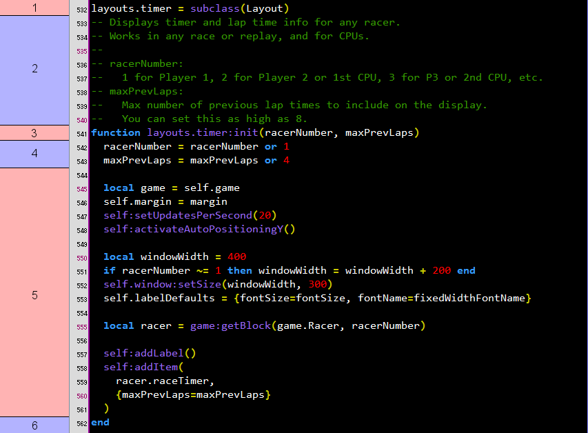

# Games, versions, layouts, and options

This section covers:

- How picking a game and version works. The first tutorial section spelled out the bare minimum to let you run a script, but here you'll learn where in the code this comes from.
- How to pick a different RAM display layout for a particular game.
- How to specify options to tweak exactly how a layout is displayed.

In any case, you'll need to start reading the Lua code. It's not as scary as it sounds though. For the purposes of this section, you just have to recognize a few specific code patterns and grab some names from them.


## Getting a code editor program (Recommended)

Get a code editor program that supports Lua syntax highlighting (coloring). It's generally easier to read code with syntax highlighting. First screenshot is without (Notepad), second screenshot is with (JEdit):

   
   

   - JEdit and Notepad++ are pretty basic code editors that should work.
   
   - If you don't have a code editor and don't feel like downloading one, you can probably still get through this tutorial with just Notepad. If you're writing layouts or game scripts later, though, you'll most likely want a code editor.

   - If you end up writing a lot of Lua, consider ZeroBrane Studio. It has more advanced features like code completion and jumping to definitions, and it's still free and pretty light on resources.
   
   
## Finding game scripts and layout scripts

Look in the `games` folder to find game-specific Lua scripts. We have some naming conventions to make it easier to find particular scripts:

   - Layout scripts: Scripts with the word `layouts` in them, such as `fzerogx_layouts.lua`.
   - Helper scripts (for games with complex logic): Scripts with an underscore `_` at the beginning, such as `_supermariogalaxyshared.lua`. You don't need to worry about these for now.
   - Game scripts: All other scripts, such as `fzerogx.lua`.
   
In most cases you'll just have `gamename.lua` and its corresponding `gamename_layouts.lua`, but later in this section we'll show how the layouts for each game are actually specified.
   
   
## Game versions
   
Supported game versions are specified in game scripts such as `fzerogx.lua` and `supermariogalaxy.lua`.

Open a game script in your code editor. Do a Ctrl+F (text search) for `supportedGameVersions`. The first result should show which game versions are supported by the game script. For example:

```lua
SMG1.supportedGameVersions = {
  -- Wii must be set to English language.
  na = 'RMGE01',
  us = 'RMGE01',

  jp = 'RMGJ01',
  ja = 'RMGJ01',

  -- Wii must be set to English language.
  eu = 'RMGP01',
  pal = 'RMGP01',
}
```
    
This shows support for the North American version, Japanese version, and European version.
   
Each version has one or more aliases which you can use in your Cheat Table script. So for the North American version, you can use either `na` or `us`. For the European version, you can use either `eu` or `pal`. And so on.
   
If you're not sure which version you have, right-click the game in Dolphin's game list, choose Properties, then choose the Info tab. The "Game ID" field should have something like `RMGE01` or `RMGJ01`, which should help you confirm the version.
   
There may also be additional comments, such as the ones above about setting the Wii to a specific language, so pay attention to that.
   
Many game scripts only support one version (most commonly North America). If you're wondering: A lack of support for a particular version or language doesn't mean that it's too difficult to support it. The main barrier is that the script author may not have had access to all versions, or the time to test them all.


## Finding the layout script(s) for a particular game

Open a game script in your code editor. Do a Ctrl+F (text search) for `layoutModuleNames`. The first result should show which Lua script(s) have the layouts for this game. For example, in `supermariogalaxy.lua`:

```lua
SMG1.layoutModuleNames = {'supermariogalaxy_layouts'}
```
    
This shows that, not surprisingly, `supermariogalaxy_layouts.lua` has the layouts for Super Mario Galaxy.

In most cases, if the game script is `gamename.lua`, then the layout script is `gamename_layouts.lua`. But if you check the `layoutModuleNames` of `supermariogalaxy2.lua`, you'll see that the layouts are also in `supermariogalaxy_layouts.lua` (without a `2`), because both Mario Galaxy games share a lot of things in common.


## Layouts
   
Open a layout script in your code editor. There's some setup code at the top of the script, then one or more layout definitions, then a bit of code at the bottom.

Here's what a layout definition looks like:


1. Layout instantiation. Here we can see the layout's name is `kmhRecording`. (Don't worry about knowing the term "instantiation". We're just giving this section a name.)

1. Comments explaining the layout (may or may not be present). `--` at the start of a Lua line indicates a comment. Comments do not change the running behavior of the script; comments only serve to explain things to the reader.

1. Header of this layout's initialization function.

1. Body of this layout's initialization function. In our layout scripts, these lines of code will always be indented at least two spaces from the left side, making it easier to see where the function body starts and ends. (Just be careful if your editor program has "word wrap" turned on; sometimes that makes the indentation look weird.)

1. `end` keyword which closes this layout's initialization function. You may also see `end` within the function body (previous section), but those `end` keywords will be indented by at least two spaces. This `end` for the end of the function will not have indentation spaces.

The layout scripts you'll find in this Lua framework define one or more layouts like this, with a couple of blank lines separating layout definitions:

```lua
layouts.addressTest = subclass(Layout)
function layouts.addressTest:init()
  -- Code goes here
end


layouts.kmhRecording = subclass(Layout)
-- Some comments go here
function layouts.kmhRecording:init()
  -- Code goes here
end


layouts.energy = subclass(Layout)
function layouts.energy:init(numOfRacers)
  -- Code goes here
end
```

So, here's what you need to know so far:

- Know how to tell where each layout definition starts and ends. Let the indentation guide you.
- To find the layout name, check section 1 (layout instantiation) or 3 (init function header).
- When you run a layout and you're not sure what it does, section 2 (comments), if present, can help you figure it out. You can also try skimming through section 4 (init function body) for clues.


## Running

You should now know how to pick a game name, game version, and layout name. So you can use them like in the [first tutorial section](run.md#running) to get the layout of your choice up and running.

Here are some additional notes and tips:

- Game versions are not case sensitive. So if `supportedGameVersions` includes an `na` version, your Cheat Table script can have either `na`, `NA`, `Na`, or `nA`. On the other hand, layout names ARE case sensitive. If a layout name is `kmhRecording`, and your Cheat Table script has `kmhrecording`, it won't work.

- If you have one layout running and you want to try a different layout: Edit the layout name in the Cheat Table script, and click Execute Script again. A new RAM display window should appear with the new layout. You can now close the old layout's RAM display window, as it's no longer in use.

- If you get an error when running a script, see the [Troubleshooting and debugging](/debugging.md) page for advice.

- Some of the layouts will show a button that, when clicked, will start recording RAM values to a `ram_watch_output.txt` file. This file will be in one of two places:

  - The same folder as the .CT (cheat table) file you have open, or
  
  - The same folder as the Cheat Engine .exe file, if you don't have a .CT file open.
   
   
## Layouts with options

Some layouts support options that let you customize the behavior or look of the RAM display. Here's what that looks like:



1. Layout instantiation, same as before.

1. Comments. In this case this includes some explanation on each option.

1. Header of this layout's initialization function. All of the options are listed between the parentheses.

1. The first part of the init function's body. Here a default value is defined for each option. If you use this layout without specifying a `racerNumber` value, then `racerNumber` will be 1. If you don't specify a `maxPrevLaps` value, then it will be 4. 

1. The remainder of the init function's body.

1. `end` keyword, same as before.
   
Here's how you specify values for the layout options in your Cheat Table script:

```lua
...

RWCEOptions = {
  gameModuleName = 'yourgamenamehere',
  gameVersion = 'yourgameversionhere',
  layoutName = 'yourlayoutnamehere',
  layoutOptions = {2, 8},

  ...
}

...
```
   
That is, you add a `layoutOptions = {...},` line, where the options are listed between the curly braces `{` `}`, separated by commas.
   
The option values are applied in order. The init function header defines the order of the options: `racerNumber` first, then `maxPrevLaps` second. So, `racerNumber` becomes `2`, and `maxPrevLaps` becomes `8`.
   
- If you're familiar with other programming languages and you're wondering what this `{` `}` syntax is, you can read about [Lua tables](http://lua-users.org/wiki/TablesTutorial).
   
Here's another example of a layout with options:
    
```lua
layouts.inputs = subclass(Layout)
function layouts.inputs:init(calibrated, playerNumber)
  calibrated = calibrated or false
  playerNumber = playerNumber or 1

  -- ...
end
```
    
As you can see, not every option has a numeric value. `calibrated` here is a boolean option, taking either `true` or `false`.

Most of the time, options won't take mixed types of values, so you can tell what type of values will be accepted based on the default value. Common types of values are:

Type | Examples
--- | ---
Integer | `0`, `1`, `22`, `-1`
Boolean | `true`, `false`
String | `'drag'`, `'maxSpeed'`
Float | `0.5`, `3.38`, `-99.16`
Table (of integers, strings, etc.) | `{'accel', 'maxSpeed'}`, `{0, 1, 3, 7}`

But just because the default value is a integer, doesn't mean that any integer will make the display work fine. For example, it doesn't make sense to display `-1` previous lap times. If there are comments available for a layout, be sure to read those comments to get clarification on the options.

If you think any of the pre-defined layouts have unclear options (or are just unclear in general), you can [ask about it](/README.md#support).


## Window-level options

The following options are available regardless of your layout:

```lua
...

RWCEOptions = {
  ...
  
  windowPosition = {300, 500},

  ...
}

...
```

- This `windowPosition` example puts the RAM display window 300 pixels from the left edge of your computer screen, and 500 pixels from the top edge. If you don't specify `windowPosition`, the window appears near the center of the screen. You can drag the window wherever you want, of course, but it can be convenient to make the window start at a specific spot automatically.

---

[Back to the tutorial index](index.md)
